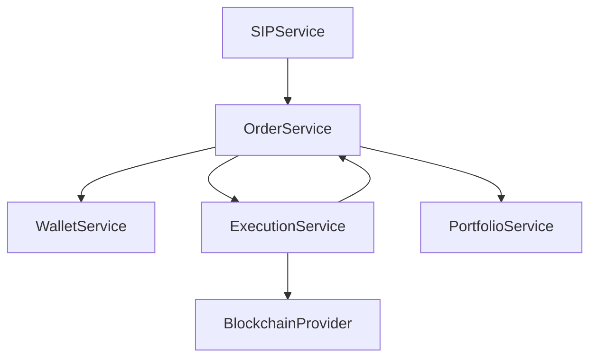

# Crypto ETF Backend — API & Architecture Blueprint

## 1. Objectives & Scope
- Provide a backend reference for a crypto ETF platform where user investments, SIP-style plans, compliance, and reporting are handled off-chain.
- Limit on-chain activity to ERC20 transfers that settle ETF share issuance/redemption and record underlying basket rebalances.
- Reuse the existing Express/Mongoose stack (routes → controllers → services → repos) while adding domain-specific modules.
- Support phased delivery: MVP (single ETF, SIP buy-only) → multi-ETF, rebalancing automation, advanced reporting.

## 2. Platform Architecture
```
Clients (Web, Mobile, Admin)
        │
   API Gateway (Express + Routes)
        │
 Controllers → Services → Repos (MongoDB)
        │
 Domain Modules (Auth, ETF Catalog, SIP Engine, Orders, Wallet, Compliance)
        │
 Background Workers (node-cron / queue consumers)
        │
 Blockchain Bridge (ethers.js providers) ──> ERC20 network
```

### Core Components
1. **Auth & Identity Service**
   - Firebase ID tokens + custom claims for RBAC.
   - Manages sessions, 2FA toggle, device tracking.
2. **User Profile & KYC Service**
   - Existing KYC flows extended with ETF-specific questionnaires (risk profile, investment horizon).
3. **ETF Catalog Service**
   - CRUD for ETF definitions, target weights, management fees, cut-off times.
   - Stores NAV policies and eligible assets list.
4. **Wallet & Funding Service**
   - Custodial stablecoin wallet per user (existing AES-encrypted wallet infra).
   - Handles deposits (on-chain listener) and fiat/stable conversion records.
5. **Order & SIP Engine**
   - Handles one-time buys, recurring SIPs (daily/weekly/monthly), pause/resume, top-ups.
   - Computes required token quantities vs. NAV and pushes execution intents.
6. **Trade Execution & Blockchain Bridge**
   - Signs ERC20 transfers for:
     - User → treasury (funding)
     - Treasury → user (redemption)
     - Treasury ↔ DEX for basket rebalancing
   - Emits transaction hashes back to Order service.
7. **Portfolio & NAV Service**
   - Tracks ETF units per user, cost basis, unrealized PnL.
   - Stores hourly/daily NAV snapshots from on-chain price oracles/aggregators.
8. **Compliance & Audit**
   - KYB/KYC state machine, AML rules, audit trails per order.
9. **Notifications & Reporting**
   - Webhooks/email/push for SIP execution, NAV change, compliance actions.
   - Admin dashboards for AUM, inflows, churn.

## 3. Domain Model (Mongo Collections)
| Collection | Purpose | Notes/Indexes |
|------------|---------|---------------|
| `users`, `user_profiles`, `kyc_status` | Existing onboarding data | Index on `uid`, `kyc_status.status`. |
| `etf_products` | ETF metadata (symbol, weights, rebalance policy) | Unique `symbol`, embed components array. |
| `etf_components` | Underlying asset definitions (token address, decimals) | Index `tokenAddress`. |
| `wallets`, `wallet_transactions` | Custodial wallet state, ERC20 transfer logs | `status`, `txHash` indexes. |
| `funding_accounts` | Links payment rails (fiat, UPI, bank) to users | Tracks AML flags. |
| `orders` | One-time purchase/redeem intents | Status pipeline: `created → funded → executing → settled`. |
| `sip_plans` | Recurring SIP configs | Fields: `frequency`, `nextRunAt`, `autoPause`, `maxAmount`. |
| `sip_schedules` | Materialized instances per run (idempotency) | Unique on (`planId`, `runDate`). |
| `order_fills` | Execution fills returned by Execution service | Stores token amounts, tx hashes. |
| `etf_units` | User holdings ledger (unit balance, avg cost) | Index `uid+etfId`. |
| `nav_snapshots` | NAV per ETF per interval | Partitioned by `date`. |
| `rebalance_jobs` | Tracks pending/completed ETF rebalances | Includes rationale + approvals. |
| `notifications`, `audit_logs` | Compliance + user comms trail | Append-only; use TTL for low-value logs. |

## 4. Module Responsibilities & Interfaces
- **Auth Middleware**: Validate Firebase tokens, attach `req.user`, enforce roles (`user`, `ops`, `admin`, `compliance`).
- **ETF Catalog Controller (`/etfs`)**:
  - `GET /etfs` public metadata.
  - Admin endpoints for creating/updating ETFs, uploading factsheets, managing cut-off rules.
- **Wallet Controller (`/wallet`)**:
  - `GET /wallet/balance`, `POST /wallet/deposit-intent`, `POST /wallet/withdraw`.
- **Investment Controller (`/investments`)**:
  - `POST /investments/orders` (lumpsum buy), `POST /investments/orders/:id/cancel`.
  - `POST /investments/redemptions`, `GET /investments/orders`.
- **SIP Controller (`/sip`)**:
  - `POST /sip/plans`, `PATCH /sip/plans/:id` (pause/resume/update), `GET /sip/plans`.
  - `GET /sip/plans/:id/schedules` for history.
- **Portfolio Controller (`/portfolio`)**:
  - `GET /portfolio/summary`, `GET /portfolio/positions/:etfId`, `GET /portfolio/transactions`.
- **NAV & Market Data Controller (`/market`)**:
  - `GET /market/etfs/:id/nav`, `GET /market/etfs/:id/composition`.
- **Admin & Compliance Controller (`/admin/etf`, `/admin/orders`, `/admin/compliance`)**:
  - Approve rebalances, manual overrides, suspicious activity reviews.
- **Test Mode Controller (`/test/etf`)**:
  - Seed ETF products, simulate SIP runs, generate fake oracles.

Services should expose methods such as:


## 5. API Surface (Draft)
| Endpoint | Method | Description | Auth |
|----------|--------|-------------|------|
| `/etfs` | GET | List ETF products with NAV, cut-off, min amount | Public |
| `/etfs/:id` | GET | ETF detail + latest composition | Public |
| `/investments/orders` | POST | Create buy order (specify ETF, amount, funding source) | User |
| `/investments/orders` | GET | List user orders w/ status | User |
| `/investments/orders/:id/cancel` | POST | Cancel pending order before cut-off | User |
| `/investments/redemptions` | POST | Request ETF unit redemption → stablecoin | User |
| `/sip/plans` | POST | Create SIP (frequency, start date, amount, autopause rules) | User |
| `/sip/plans/:id` | PATCH | Pause/resume/update limit | User |
| `/sip/plans/:id` | DELETE | Terminate SIP | User |
| `/portfolio/summary` | GET | Aggregated holdings, AUM, XIRR | User |
| `/portfolio/positions/:etfId` | GET | Position detail & transaction history | User |
| `/wallet/deposit-intent` | POST | Produce deposit instructions (bank/UPI or ERC20 address) | User |
| `/wallet/withdraw` | POST | Redeem stablecoins/fiat | User |
| `/market/etfs/:id/nav` | GET | NAV history | Public |
| `/admin/etfs` | POST | Create/modify ETF product | Admin |
| `/admin/rebalance` | POST | Submit rebalance proposal | Admin |
| `/admin/orders/:id/override` | POST | Force status transition | Ops |
| `/admin/compliance/reviews` | GET | List AML alerts | Compliance |
| `/test/etf/bootstrap` | POST | Seed ETF + SIP scenario in test mode | None (TEST_MODE) |

## 6. Core Business Flows
### 6.1 User Onboarding & Funding
1. User authenticates via Firebase → `POST /users/bootstrap`.
2. Completes KYC forms; compliance service updates status.
3. User requests deposit instructions → `POST /wallet/deposit-intent`.
4. On-chain listener picks up ERC20 transfer → `wallet_transactions` entry → marks `funding_accounts` as funded.

### 6.2 SIP Creation
1. Client calls `POST /sip/plans` with ETF id, amount, frequency.
2. SIP service validates cut-off windows, ensures wallet auto-debit authorization.
3. Plan stored in `sip_plans`; `nextRunAt` scheduled via cron/queue.
4. Notification service confirms to user.

### 6.3 SIP Execution & ERC20 Settlement
1. Scheduler wakes before cut-off, batches eligible plans into `sip_schedules`.
2. Order service creates `orders` referencing funding source + NAV snapshot.
3. Wallet service earmarks balance (status `locked`).
4. Execution service calculates ERC20 transfers (ETF share mint) and underlying buys if needed.
5. Blockchain bridge signs transfers via treasury wallet (ethers.js) and posts tx hash.
6. Order status updates to `settled`; `etf_units` updated; wallet debited.
7. SIP schedule logs success/failure for analytics.

### 6.4 Redemption / Withdrawal
1. User requests redemption → `POST /investments/redemptions`.
2. Order service verifies available units, locks them.
3. Execution service burns ETF units (internal) and transfers ERC20/stablecoin back to user.
4. Wallet transaction recorded; compliance notified for large withdrawals.

### 6.5 Rebalancing
1. Admin submits rebalance plan (`/admin/rebalance`).
2. Compliance approves (two-step).
3. Execution service runs sequential ERC20 swaps (via DEX aggregator) to reach new weights.
4. NAV service recalculates and publishes updated basket; portfolio deltas distributed pro rata.

### 6.6 NAV Publication
1. Price oracles feed scheduler (`nav_snapshots`).
2. NAV service calculates ETF NAV = Σ(component price * weight) / total units.
3. API exposes latest + historical NAV; SIP engine references same snapshot for fairness.

## 7. Blockchain Integration Details
- **Listeners**: `src/listeners/erc20Listener.js` subscribes to treasury wallet transfers; filters deposits, redemptions, DEX trades.
- **Signers**: `src/services/blockchain/transactionService.js` builds and signs transfers with hardware wallet or KMS (AWS KMS or GCP Cloud KMS).
- **Safeguards**:
  - Allowlist token addresses + spending caps.
  - Multi-sig approval for transactions above configurable threshold.
  - Nonce management + retry queue for stuck transactions.
- **Data Bridging**:
  - Every tx recorded in `wallet_transactions` with reconciliation status (`pending_chain`, `confirmed`, `reconciled`).
  - Periodic reconciliation job matches on-chain logs with internal ledger.

## 8. Background Jobs & Eventing
- `sipScheduler` (cron or Bull queue) – materialize SIP runs, enforce cut-off times.
- `orderSettlementWorker` – waits for blockchain confirmations before crediting ETF units.
- `navPublisher` – hourly/daily NAV computation + caching layer (Redis).
- `rebalanceOrchestrator` – steps through multi-leg basket trades.
- `complianceScanner` – AML rules (velocity checks, sanctions, structuring).
- `notificationDispatcher` – push/email/in-app for orders, SIP runs, compliance alerts.

## 9. Configuration & Environment Variables
| Variable | Description |
|----------|-------------|
| `MONGODB_URI` | Primary database connection string. |
| `TEST_MODE` | Enables `/test` routes and bypasses Firebase verification. |
| `FIREBASE_*` | Existing Firebase service account keys. |
| `ERC20_TREASURY_PRIVATE_KEY` or KMS identifiers | Signer for treasury wallet. |
| `ERC20_TOKEN_ADDRESS` | ETF share contract. |
| `DEX_ROUTER_ADDRESS`, `RPC_WS_URL`, `RPC_HTTP_URL` | For execution + listeners. |
| `SIP_CUTOFF_TIME`, `SIP_TIMEZONE` | Controls scheduling logic. |
| `NAV_SNAPSHOT_CRON`, `REBALANCE_APPROVER_UIDS` | Ops controls. |
| `NOTIFICATION_PROVIDER_KEYS` | Email/push providers. |

## 10. Phased Delivery
1. **Phase 0 (Setup)**: Finalize ETF schema, seed sample product, wallet funding flow, manual NAV input.
2. **Phase 1 (MVP SIP)**: Enable deposits, lumpsum buy, SIP creation/execution with mocked ERC20 transfers (testnet).
3. **Phase 2 (Full ERC20 Settlement)**: Connect to mainnet/testnet, automate treasury transfers, add redemption.
4. **Phase 3 (Ops & Compliance)**: Rebalancing workflows, AML dashboards, audit exports.
5. **Phase 4 (Scale)**: Multi-ETF support, performance tuning, advanced analytics, partner APIs.

---
This blueprint can be iterated as requirements solidify; future edits should record decisions, data contracts, and sequence diagrams as we progress into implementation.
